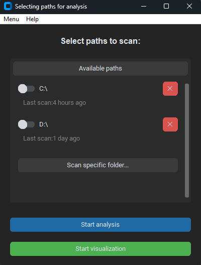
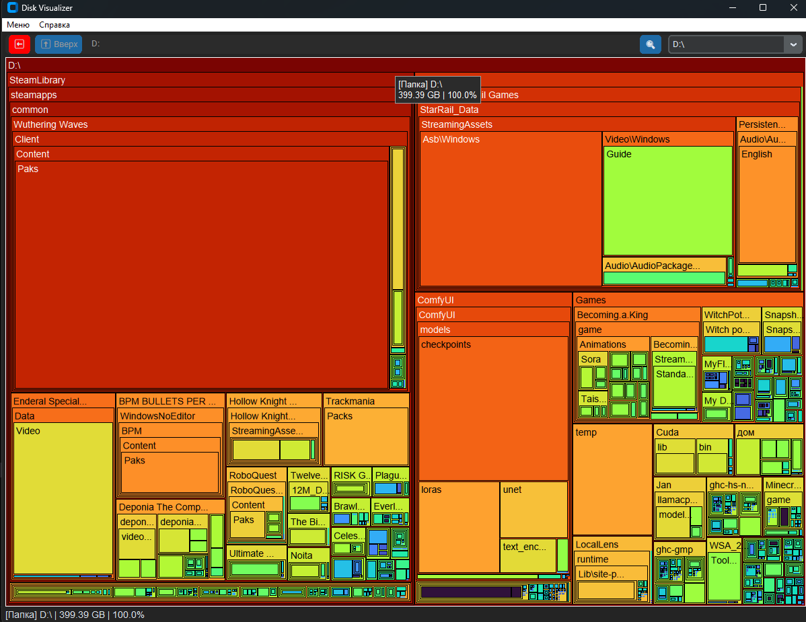
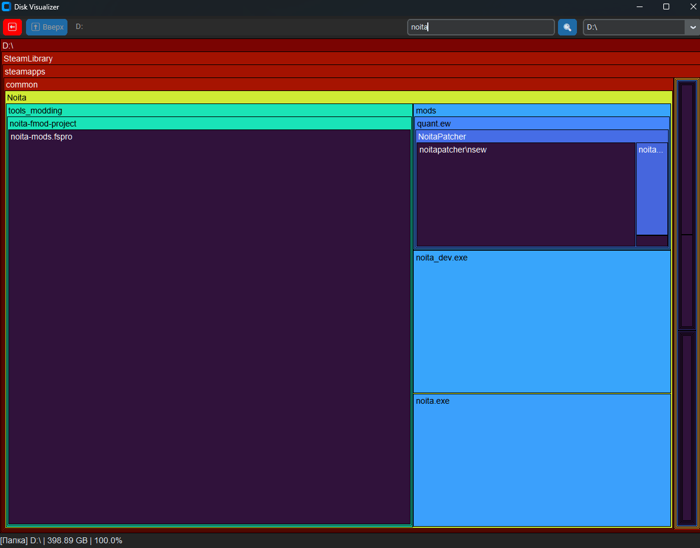

# Disk Analyzer

<div align="center">

**[🇷🇺 Русский](README_RU.md) | [🇬🇧 English](#english)**

</div>

---

# 📖 English

A small program for collecting information about files and folders on a selected disk and creating a visualization based on their sizes.

## Key Features:

- Beautiful and convenient fully graphical user interface
- Fast multi-threaded disk scanning
- Quick search through already scanned data
- Clear data representation

## 📷 Screenshots

Folders and files are colored in a heat map, depending on how much disk space they occupy

| Disk Selection |
| :---: |
|  |

| Visualization | Search Results |
| :---: | :---: |
|  |  |

## Installation

<strong>Download the latest version from [releases](https://github.com/Aetorny/Disk-Analyzer/releases)</strong>

Currently only Windows builds are supported

<details>
<summary><strong>Windows</strong></summary>

### Requirements:
- **Python 3.14+**
- `pip` (usually included with Python)

It is recommended to use Python 3.14t (version with disabled GIL) for maximum performance.

```powershell
# Clone the repository or download the archive and navigate to the project folder
git clone https://github.com/Aetorny/Disk-Analyzer
cd ".\Disk-Analyzer\"

# (Recommended) Create a virtual environment and activate it (PowerShell)
python -m venv .venv
.\.venv\Scripts\Activate.bat

# Install dependencies
pip install -r .\requirements.txt

# Run the program
python main.py
```
</details>

## Program Usage and Keyboard Shortcuts

Currently available:
- `Ctrl + f` - Enable the search bar. Search works across the entire current disk, it takes some time, wait for the UI to update.

## 🛠 Debugging and Notes

- To recreate reports, run the application again and rescan the required disks.

## License

This project is distributed under the **MIT License** — see the `LICENSE` file in the repository root for the full text.

In short: you can use, copy, modify, and distribute the code, including in commercial projects, provided that you preserve the copyright notice and this permission (attribution).
